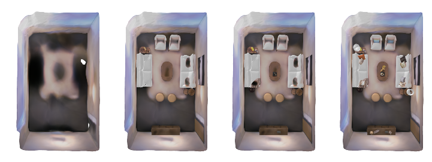

[comment]: <> (# vMAP: Vectorised Object Mapping for Neural Field SLAM)

<!-- PROJECT LOGO -->

<p align="center">

  <h1 align="center">vMAP: Vectorised Object Mapping for Neural Field SLAM</h1>
  <p align="center">
    <a href="https://kxhit.github.io"><strong>Xin Kong</strong></a>
    ·
    <a href="https://shikun.io"><strong>Shikun Liu</strong></a>
    ·
    <a href="https://marwan99.github.io/"><strong>Marwan Taher</strong></a>
    ·
    <a href="https://www.doc.ic.ac.uk/~ajd/"><strong>Andrew Davison</strong></a>
  </p>

[comment]: <> (  <h2 align="center">PAPER</h2>)
  <h3 align="center"><a href="https://arxiv.org/abs/TODO">Paper</a> | Video | <a href="https://kxhit.github.io/vMAP">Project Page</a></h3>
  <div align="center"></div>
</p>
<p align="center">
  <a href="">
    
  </a>
</p>
<p align="center">
vMAP builds an object-level map from a real-time RGB-D input stream. Each object is represented by a separate MLP neural field model, all optimised in parallel via vectorised training. 
</p>
<br>

We provide the implementation of the following neural-field SLAM frameworks:
- **vMAP** [Official Implementation] 
- **iMAP** [Improved Official Implementation, with guided depth sampling]


## Install
First, let's start with a virtual environment with the required dependencies.
```bash
conda env create -f environment.yml
```

## Dataset
Please download the following datasets to reproduce our results.

* [Replica Demo](https://huggingface.co/datasets/kxic/vMAP/resolve/main/demo_replica_room_0.zip) - Replica Room 0 only for faster experimentation.
* [Replica](https://huggingface.co/datasets/kxic/vMAP/resolve/main/vmap.zip) - All Replica sequences.
* [ScanNet](https://github.com/ScanNet/ScanNet) - Official ScanNet sequences.
Each dataset contains a sequence of RGB-D images, as well as their corresponding camera poses, and object instance labels.

```bash
conda activate py2
python2 reader.py --filename ~/data/ScanNet/scannet/scans/scene0024_00/scene0024_00.sens --output_path ~/data/ScanNet/objnerf/ --export_depth_images --export_color_images --export_poses --export_intrinsics
```

## Config

Then update the config files in *configs/.json* with your dataset paths, as well as other training hyper-parameters.
```json
"dataset": {
        "path": "path/to/ims/folder/",
    }
```

## Running vMAP / iMAP
The following commands will run vMAP / iMAP in a single-thread setting (singe GPU for both training and visualisation).
[comment]: <> (### Single thread demo)
#### vMAP
```bash
python ./train.py --config ./configs/Replica/config_replica_room0_vMAP.json --logdir ./logs/vMAP/room0 --save_ckpt True
```
#### iMAP
```bash
python ./train.py --config ./configs/Replica/config_replica_room0_iMAP.json --logdir ./logs/iMAP/room0 --save_ckpt True
```

[comment]: <> (#### Multi thread demo)

[comment]: <> (```bash)

[comment]: <> (./parallel_train.py --config "config_file.json" --logdir ./logs)

[comment]: <> (```)

## Evaluation
To evaluate the quality of reconstructed scenes, we provide two different methods,
#### 3D Scene-level Evaluation
The same metrics following the original iMAP, to compare with GT scene meshes by **Accuracy**, **Completion** and **Completion Ratio**.
```bash
python ./metric/eval_3D_scene.py
```
#### 3D Object-level Evaluation
We also provide the object-level metrics by computing the same metrics but averaging across all objects in a scene.
```bash
python ./metric/eval_3D_obj.py
```

[comment]: <> (### Novel View Synthesis)

[comment]: <> (##### 2D Novel View Eval)

[comment]: <> (We rendered a new trajectory in each scene and randomly choose novel view pose from it, evaluating 2D rendering performance)

[comment]: <> (```bash)

[comment]: <> (./metric/eval_2D_view.py)

[comment]: <> (```)

## Acknowledgement
We would like thank the following open-source repositories that we have build upon for the implementation of this work: [NICE-SLAM](https://github.com/cvg/nice-slam), and [functorch](https://github.com/pytorch/functorch).

## Citation
If you found this code/work to be useful in your own research, please considering citing the following:
```bibtex
@article{kong2023vmap,
  title={vMAP: Vectorised Object Mapping for Neural Field SLAM},
  author={Kong, Xin and Liu, Shikun and Taher, Marwan and Davison, Andrew J},
  journal={arXiv preprint arXiv:TODO},
  year={2023}
}
```

```bibtex
@inproceedings{sucar2021imap,
  title={iMAP: Implicit mapping and positioning in real-time},
  author={Sucar, Edgar and Liu, Shikun and Ortiz, Joseph and Davison, Andrew J},
  booktitle={Proceedings of the IEEE/CVF International Conference on Computer Vision},
  pages={6229--6238},
  year={2021}
}
```

